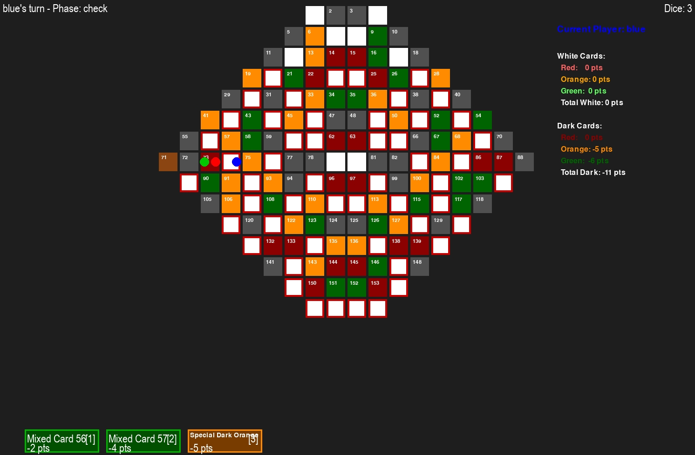

Heavenly Hex: Snakes and Virtues
Heavenly Hex เป็นโปรเกมกระดานดิจิทัลที่พัฒนาขึ้นโดยได้รับแรงบันดาลใจจากบอร์ดเกมเชิงธรรมะ "Bull Battle" 
โดยวัดญาณเวศกวัน https://nyanavesk.online/th/program-detail/BBgame
โปรเจกต์นี้เป็นการประยุกต์ใช้ทฤษฎีเกม (Game Theory) ร่วมกับระบบ Hexagonal Grid เพื่อสร้างประสบการณ์การเรียนรู้เรื่องจริยธรรม (Virtues and Vices) ผ่าน Gameplay ที่ทันสมัย

🌟 Project Overview
เกมนี้ถูกออกแบบมาเพื่อจำลองการเดินทางของชีวิต โดยใช้ Hexagonal Map (รวงผึ้ง) แทนตารางสี่เหลี่ยมแบบดั้งเดิม เพื่อเพิ่มมิติการเดินและการวางแผน ผู้เล่นจะต้องสะสม "บุญ" (Virtues) เพื่อไต่ขึ้นสู่จุดสูงสุด และหลีกเลี่ยง "บาป" (Vices) ที่จะดึงผู้เล่นลงสู่จุดต่ำสุด

Key Features & Technical Highlights:
Hexagonal Grid Logic: พัฒนาระบบพิกัดแบบ Hexagonal Coordinate System เพื่อจัดการการเคลื่อนที่บนแผนที่รวงผึ้ง

Dynamic Event System: ระบบสุ่มเหตุการณ์ที่อ้างอิงจากหลัก "คิดดี พูดดี ทำดี" ซึ่งส่งผลต่อสถานะของผู้เล่นในเกม

State Management: จัดการสถานะผู้เล่น (Position, Karma Points, Buff/Debuff) อย่างเป็นระบบ

Reinvented Classic Mechanics: นำกลไก Snakes & Ladders มาปรับปรุงใหม่ (Refactor) ให้มีความซับซ้อนและน่าสนใจมากขึ้น

🛠 Tech Stack
Language: [ระบุภาษาที่ใช้ เช่น JavaScript, Python, C#]

Framework/Library: [เช่น React, Unity, Pygame]

Pattern: MVC (Model-View-Controller) หรือ Component-Based Architecture [เลือกตามที่คุณใช้]

🎮 How to Play
The Ascent: ผู้เล่นเริ่มจากฐานรวงผึ้งและเป้าหมายคือจุดยอดสุด (Heaven/Nirvana)

Virtue Tiles: เมื่อตกในช่อง "ความดี" ผู้เล่นจะได้รับสิทธิ์ในการข้ามระดับ (Ladder mechanic)

The Abyss: หากตกในช่อง "อบาย" หรือทำคะแนนติดลบ จะตกลงสู่จุดต่ำสุด (Hell/Avici) ซึ่งมีการออกแบบให้การกลับขึ้นมาต้องใช้ความพยายามมากกว่าปกติ (Difficult Recovery Logic)

📈 Learning Objectives (The "Why")
โปรเจกต์นี้ไม่ได้เป็นเพียงแค่เกม แต่เป็นการทดลองสร้าง Gamification for Education เพื่อ:

สาธิตการใช้พิกัดเชิงคณิตศาสตร์ในโครงสร้างข้อมูลแบบรวงผึ้ง

นำหลักปรัชญามาเปลี่ยนเป็น Logic ของเกม (Translating Philosophy into Code)

ฝึกฝนการออกแบบ User Experience (UX) สำหรับเกมแนวผลัดกันเล่น (Turn-based game)
